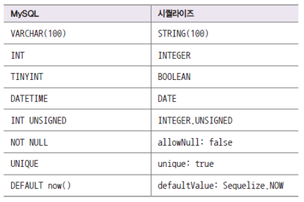
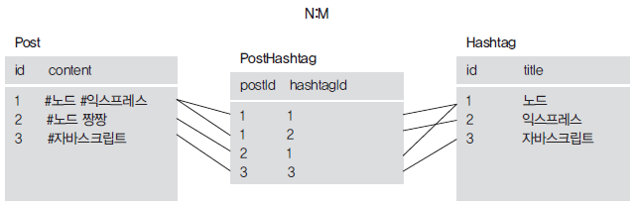

# 시퀄라이즈 ORM

sql 작업을 쉽게 할 수 있도록 도와주는 라이브러리

- ORM: Object Relational Mapping: 객체와 데이터를 매핑(1대1 짝지음)
- MySQL 외에도 다른 RDB(Maria, Postgre, SQLite, MSSQL)와도 호환됨
- 자바스크립트 문법으로 데이터베이스 조작 가능

## 시퀄라이즈 설치

시퀄라이즈 명령어 사용하기 위해 sequelize-cli 설치

- mysql2는 MySQL DB가 아닌 드라이버(Node.js와 MySQL을 이어주는 역할)
- sequelize-cli는 sequelize 명령어 사용할 수 있게 해주는 패키지

```java
npm i express morgan nunjucks sequelize sequelize-cli mysql2
npm i -D nodemon
```

npx sequelize init 으로 시퀄라이즈 구조 생성

```java
npx sequelize init
```

config/config.json, models폴더, migrations 폴더, seeders 폴더 생김

## 시퀄라이즈 기본 설정

### models/index.js 수정

```java
const Sequelize = require('sequelize');

const env = process.env.NODE_ENV || 'development';
const config = require('../config/config')[env];
const db = {};

const sequelize = new Sequelize(config.database, config.username, config.password, config);

db.sequelize = sequelize;

module.exports = db;
```

- require(../config/config) 설정 로딩 (db 설정)
- new Sequelize로 DB와 연결 가능

### MySQL 연결하기

- app.js 작성
  - sequelize.sync 로 연결

```java
sequelize.sync({force: false})
	.then(() => {
		console.log('데이터베이스 연결 성공');
	})
	.catch((err) => {
		console.error(err);
	});
```

## 모델 생성하기

테이블 생성 방법

- cmd에서 만들기
- workbench에서 만들기
- **시퀄라이즈 모델 사용**

```java
const Sequelize = require('sequelize');

module.exports = class Comment extends Sequelize.Model {
    static init(sequelize) {
        return super.init({
            // 컬럼명 정의
        }, {
            // 모델에 대한 설정
        });
    }

    static associate(db) {
        // 관계 설정
    }
}
```

```java
const Sequelize = require('sequelize');

module.exports = class Comment extends Sequelize.Model {
    static init(sequelize) {
        return super.init({
            // commenter(댓글단사람)이 없는 이유는 시퀄라이즈에서 관계컬럼으로 특별하게 자동으로 만들어줌
            comment: {
                type: Sequelize.STRING(100),
                allowNull: false,
            },
            created_at: {
                type: Sequelize.DATE,
                allowNull: true,
                defaultValue: Sequelize.NOW,
            },
        }, {
            sequelize,
            timestamps: false,
            modelName: 'Comment',
            tableName: 'comments',
            paranoid: false,
            charset: 'utf8mb4',
            collate: 'utf8mb4_general_ci',
        });
    }

    static associate(db) {
        db.Comment.belongsTo(db.User, { foreignKey: 'commenter', targetKey: 'id'});
    }
}
```

- 시퀄라이즈에서의 모델이 Mysql 에서는 테이블
- id 컬럼은 시퀄라이즈에서 자동으로 넣어주므로 생략 가능
- commenter 같은 관계컬럼도 시퀄라이즈가 자동으로 만들어준다.
- 모델에 대한 설정
  - timestamps: true 이면 createdAt, updataeAt 를 자동으로 만들어준다.
  - underscored: true 이면 자동으로 만들어주는 컬럼들의 글자를 스네이크케이스로 만들어준다. false면 카멜케이스
  - paranoid: true 이면 deletedAt을 자동으로 만들어준다. (soft delete)
  - 기본적으로 시퀄라이즈는 테이블명을 모델이름에서 앞글자를 대문자로 만든뒤 복수형으로 만든다. (modelName: ‘User’, tableName: ‘users’)



++) MySQL 에서 DATE → Sequelize 에서 DateOnly

## 댓글 모델 활성화하기

### index.js 에 모델 연결

- init 으로 sequelize와 연결
  - db 연결 객체를 모델에 전달 (모델과 mysql을 연결)
- associate로 관계 설정

```java
const Sequelize = require('sequelize');
const User = require('./user');
const Comment = require('./comment');

const env = process.env.NODE_ENV || 'development';
const config = require('../config/config')[env];
const db = {};

const sequelize = new Sequelize(config.database, config.username, config.password, config);

db.sequelize = sequelize;

db.User = User;
db.Comment = Comment;

User.init(sequelize);
Comment.init(sequelize);

User.associate(db);
Comment.associate(db);

module.exports = db;
```

## 관계 정의하기

### 1:N 관계

- 시퀄라이즈에서는 hasMany로 표현
- 반대의 입장에서는 belongsTo
- belongsTo가 있는 테이블에 컬럼이 생김
- hasMany는 sourceKey, belongsTo는 targetKey
- commenter컬럼은 belengsTo 가 있는 곳에 추가된다.

```java
static associate(db) {
    db.User.hasMany(db.Comment, {foreignKey: 'commenter', sourceKey: 'id'});    // hasMany : 1대n 관계
}
// {foreignKey: 'commenter', sourceKey: 'id'} => commenter 컬럼이 user의 id 컬럼을 참조한다.
```

```
// 반대의 입장
static associate(db) {
    db.Comment.belongsTo(db.User, { foreignKey: 'commenter', targetKey: 'id'});
}
```

### 1:1 관계

- 고객과 고객정보 테이블 간의 관계
- hasOne
- belongsTo
- 어느곳이 hasOne이고 belongsTo인지 헷갈릴때 → foreignkey컬럼을 어느테이블에 줄지 생각해보면 됨(belongsTo)

```java
static associate(db) {
    db.User.hasOne(db.Info, {foreignKey: 'UserId', sourceKey: 'id'});
}
```

```java
static associate(db) {
    db.Info.belongsTo(db.Info, {foreignKey: 'UserId', targetKey: 'id'});
}
```

### N:M 관계

- 예) 게시글과 해시태그 테이블

  하나의 게시글이 여러 개의 해시태그를 가질 수 있고 하나의 해시태그가 여러개의 게시글을 가질 수 있음.

- DB특성상 다대다 관계는 중간 테이블이 생김

  

- belongsToMany
- belongsToMany
- through: 중간테이블

```java
static associate(db) {
    db.Post.belongsToMany(db.Hashtag, {through: 'PostHashtag'});
}
```

```java
static associate(db) {
    db.Hashtag.belongsToMany(db.Post, {through: 'PostHashtag'});
}
```

## 시퀄라이즈 쿼리

- 특수한 기능들인 경우 Sequelize.Op의 연산자 사용 (gt, or 등)
- Op.in : 조건을 여러 개 추가할때

    ```java
    // id가 1, 3, 5 인 것들을 지우고싶을때
    User.destroy({
    	where: {id: {[Op.in]: [1, 3, 5]}}
    })
    ```


### INSERT 문

```java
// sql문
INSERT INTO nodejs.users (name, age, married, comment) VALUES ('zero', 24, 0, '자기소개');

// 시뭘라이즈 쿼리 (자바스크립트)
const { User } = require('../models');
User.create({
	name: 'zero',
	age: 24,
	married: false,
	comment: '자기소개'
});
```

### SELECT 문

```java
// sql문
SELECT * FROM nodejs.users;

// 시뭘라이즈 쿼리 (자바스크립트)
User.findAll({});
```

```java
// sql문
SELECT name, married FROM nodejs.users;

// 시뭘라이즈 쿼리 (자바스크립트)
User.findAll({
	attributes: ['name', 'married'],
});
```

```java
// sql문
SELECT name, age FROM nodejs.users WHERE married = 1 AND age > 30;

// 시뭘라이즈 쿼리 (자바스크립트)
const { Op } = require('sequelize');
const { User } = require('../models');
User.findAll({
	attributes: ['name', 'age'],
	where: {
		married: true,
		age: { [Op.gt]: 30 },
	},
});
```

```java
// sql문
SELECT if, name FROM users WHERE married = 0 OR age > 30;

// 시뭘라이즈 쿼리 (자바스크립트)
const { Op } = require('sequelize');
const { User } = require('../models');
User.findAll({
	attributes: ['id', 'name'],
	where: {
		[Op.or]: [{ married: 0}, { age: [Op.gt]: 30 } }],
	},
});
```

- order by

```java
// sql문
SELECT id, name FROM users ORDER BY age DESC;

// 시뭘라이즈 쿼리 (자바스크립트)
User.findAll({
	attributes: ['id', 'name'],
	order: [['age', 'DESC']],
]);
```

```java
// sql문
SELECT id, name FROM users ORDER BY age DESC LIMIT 1;

// 시뭘라이즈 쿼리 (자바스크립트)
User.findAll({
	attributes: ['id', 'name'],
	order: [['age', 'DESC']],
	limit: 1,
]);
```

```java
// sql문
SELECT id, name FROM users ORDER BY age DESC LIMIT 1 OFFSET 1;

// 시뭘라이즈 쿼리 (자바스크립트)
User.findAll({
	attributes: ['id', 'name'],
	order: [['age', 'DESC']],
	limit: 1,
	offset: 1,
]);
```

### UPDATE 문

```java
// sql문
UPDATE nodejs.users SET comment = '바꿀 내용' WHERE id = 2;

// 시뭘라이즈 쿼리 (자바스크립트)
User.update({
	comment: '바꿀 내용',
}, {
	where: { id: 2 },
});
```

### DELETE 문

```java
// sql문
DELETE FROM nodejs.users WHERE id = 2;

// 시뭘라이즈 쿼리 (자바스크립트)
User.destroy({
	where: { id: 2 },
});
```

## 관계 쿼리

- 결과값이 자바스크립트 객체

```java
const user = await User.findOne({});
console.log(user.nick);  // 사용자 닉네임
```

- include로 JOIN 과 비슷한 기능 수항 가능 (관계있는 것 엮을 수 있음)

```java
const user = await User.findOne({
	include: [{
		model: Comment,
	}]
});
console.log(user.Comments);  // 사용자 댓글
				// 1:N 이므로(hasMany) Comments로 가져온다. (복수형으로 자동으로 바뀜)
```

- 다대다 모델은 다음과 같이 접근 가능

```java
db.sequelize.models.PostHashtag
```

- **get + 모델명**으로 관계 있는 데이터 로딩  가능 (시퀄라이즈가 자동으로 합쳐서 만들어줌)

```java
const user = await User.findOne({});
const comments = await user.getComments();
console.log(comments);  // 사용자 댓글
```

- as로 모델명 변경 가능

```java
// 관계를 설정할 때 as로 등록
db.User.hasMany(db.Comment, { foreignKey: 'commenter', sourceKey: 'id', as: 'Ansers'});

// 쿼리할 때는
const user = await User.findOne({});
const comments = await user.getAnswers();
console.log(comments);  // 사용자 댓글
```

- include나 관계 쿼리 메서드에도 where나 attributes

```java
const user = await User.findOne({
	include: [{
		model: Comment,
		where: {
			id: 1,
		},
		attributes: ['id'],
	}]
});
// 또는
const comments = await user.getComments({
	where: {
		id: 1,
	},
	attributes: ['id'],
});
```

- 생성 쿼리

```java
// 빈 댓글을 만들어놓고 나중에 연결
const user = await User.findOne({});
const comment = await Comment.create();
await user.addComment(comment);
// 또는
await user.addComment(comment.id);
```

- 여러 개를 추가할 때는 **배열**로 추가 가능

```java
const user = await User.findOne({});
const comment1 = await Comment.create();
const comment2 = await Comment.create();
await user.addComment([comment1, comment2]);
```

- **수정은 set + 모델명, 삭제는 remove + 모델명**

## raw 쿼리

- 직접 SQL을 쓸 수 있음

```java
const [result, metadata] = await sequelize.query('SELECT * FROM comments');
console.log(result);
```