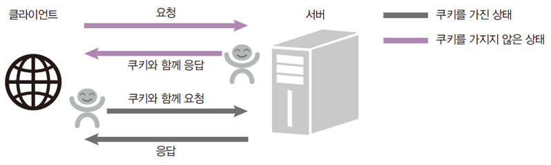
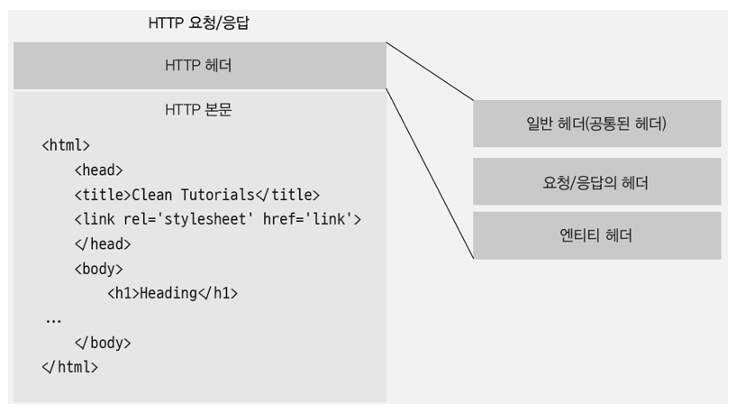

### 노드로 http 서버 만들기

http 요청에 응답하는 노드 서버

- createServer 로 요청 이벤트에 대기

```java
const http = require('http');

http.createServer((req, res) => {
});
```

### 8080 포트에 연결하기

res 메서드로 응답 보냄

- write 로 응답 내용을 적고 end로 응답 마무리(내용을 적어도 됨)

listen(포트) 메서드로 특정 포트에 연결

```java
const http = require('http');

http.createServer((req, res) => {
	res.writeHead(200, { 'Content-Type': 'text/html; charset=utf-8' });
	res.write('<h1>Hello Node!</h1>');
	res.end('<p>Hello Server!</p>);
})
	.listen(8080, () => {
	console.log('8080번 포트에서 서버 대기 중입니다.');
});
```

### localhost와 포트

포트는 서버 내에서 프로세스를 구분하는 번호

- 기본적으로 http 서버는 80번 포트 사용(생략가능. htpp는 443)
- 다른 포트로 데이터베이스나 다른 서버 동시에 연결 가능

### 이벤트 리스너 붙이기

listening과 error 이벤트를 붙일 수 있음

```java
const http = require('http');

const server = http.createServer((req, res) => {
	res.writeHead(200, { 'Content-Type': 'text/html; charset=utf-8' });
	res.write('<h1>Hello Node!</h1>');
	res.end('<p>Hello Server!</p>);
})
	.listen(8080, () => {
	console.log('8080번 포트에서 서버 대기 중입니다.');
});

serveer.on('listening', () => {
	console.log('8080번 포트에서 서버 대기 중입니다.');
});
server.on('error', (error) => {
	console.error(error);
});
```

### 한 번에 여러 개의 서버 실행하기

createServer를 여러 번 호출하면 됨

- 단, 두 서버의 포트를 다르게 지정해야 함
- 같게 지정하면 EADDRINUSE 에러 발생

### html 읽어서 전송하기

write와 end에 문자열을 넣는 것은 비효율적

- fs 모듈로 html을 읽어서 전송하자
- write가 버퍼도 전송 가능

### REST API

- 서버의 자원을 정의하고 자원에 대한 주소를 지정하는 방법

HTTP 요청 메서드

- GET
- POST
- PUT
- PATCH
- DELETE

### HTTP 프로토콜

클라이언트가 누구든 서버와 HTTP 프로토콜로 소통 가능

- ios, 안드로이드, 웹이 모두 같은 주소로 요청 보낼 수 있음
- 서버와 클라이언트의 분리

RESTful

- REST API를 사용한 주소 체계를 이용하는 서버

### 쿠키의 필요성

요청에는 한 가지 단점이 있음

- 누가 요청을 보냈는지 모름(IP 주소와 브라우저 정보 정도만 앎)
- 로그인을 구현하면 됨
- 쿠키와 세션이 필요

쿠키: 키=값의 쌍

- name=zerocho
- 매 요청마다 서버에 동봉해서 보냄
- 서버는 쿠키를 읽어 누구인지 파악



### 쿠키 서버 만들기

쿠키 넣는 것을 직접 구현

- writeHead: 요청 헤더에 입력하는 메서드
- Set-Cookie: 브라우저에게 쿠키를 설정하라고 명령

```java
const http = require('http');

http.createServer((req, res) => {
	console.log(req.url, req.headers.cookie);
	res.writeHead(200, { 'Set-Cookie': 'mycookie=test' });
	res.end('Hello Cookie');
})
	.listen(8083, () => {
		console.log('8083번 포트에서 서버 대기 중입니다!');
});
```

### 헤더와 본문

http 요청과 응답은 헤더와 본문을 가짐

- 헤더는 요청 또는 응답에 대한 정보를 가짐
- 본문은 주고받는 실제 데이터
- 쿠키는 부가적인 정보이므로 헤더에 저장



### http 상태코드

writeHead 메서드에 첫 번째 인수로 넣은 값

- 2XX: 성공을 알리는 상태코드
- 3XX: 리다이렉션(다른 페이지로 이동)을 알리는 상태코드
- 4XX: 요청 오류
- 5XX: 서버 오류

### 세션 사용하기

쿠키의 정보는 노출되고 수정되는 위험이 있음

- 중요한 정보는 서버에서 관리하고 클라이언트에는 세션키만 제공
- 서버에 세션 객체(session) 생성 후, uniqueInt(키)를 만들어 속성명으로 사용
- 속성값에 정보 저장하고 uniqueInt 를 클라이언트에 보냄

실 서버에서는 세션을 직접 구현x. 6장에 나오는 express-session 사용

### https

웹 서버에 SSL 암호화를 추가하는 모듈

- 오고 가는 데이터를 암호화해서 중간에 다른 사람이 요청을 가로채더라도 내용을 확인할 수 없음
- 요즘에는 https 적용이 필수 (개인정보가 있는 곳은 특히)

### https 서버

http 서버를 https 서버로

- 암호화를 위해 인증서를 발급받아야 함

createServer가 인자를 두 개 받음

- 첫 번째 인자는 인증서와 관련된 옵션 객체
- pem, crt, key 등 인증서를 구입할 때 얻을 수 있는 파일 넣기
- 두 번째 인자는 서버 로직

### http2

SSL 암호화와 더불어 최신 HTTP 프로토콜인 http/2를 사용하는 모듈

- 요청 및 응답 방식이 기존 http/1.1보다 개선됨
- 웹의 속도도 개선됨

### http2 적용 서버

https 모듈을 http2로, createServer 메서드를 createSecureServer 메서드로

### cluster

기본적으로 싱글 스레드인 노드가 CPU 코어를 모두 사용할 수 있게 해주는 모듈

- 포트를 공유하는 노드 프로세스를 여러 개 둘 수 있음
- 요청이 많이 들어왔을 때 병렬로 실행된 서버의 개수만큼 요청이 분산됨
- 서버에 무리가 덜 감
- 코어가 8개인 서버가 있을 때 : 보통은 코어 하나만 활용
- cluster 로 코어 하나 당 노드 프로세스 하나를 배정 가능
- 성능이 8배가 되는것은 아니지만 개선됨
- 단점 : 컴퓨터 자원(메모리, 세션 등) 공유 못함
- Redis 등 별도 서버로 해결

### 서버 클러스터링

마스터 프로세스와 워커 프로세스

- 마스터 프로세스는 CPU 개수만큼 워커 프로세스를 만듦 (worker threads랑 구조 비슷)

### 워커 프로세스 개수 확인하기

요청이 들어올때마다 서버 종료되도록 설정

- 실행한 컴퓨터의 코어가 8개이면 8번 요청을 받고 종료됨

### 워커 프로세스 다시 살리기

워커가 죽을 때마다 새로운 워커를 생성

- 이 방식은 좋지 않음
- 오류 자체를 해결하지 않는 한 계속 문제가 발생
- 하지만 서버가 종료되는 현상을 막을 수 있어 참고할 만함