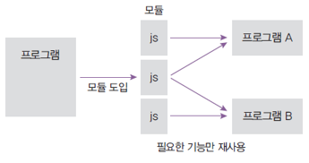
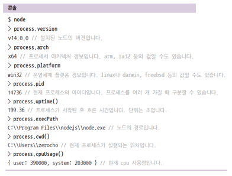
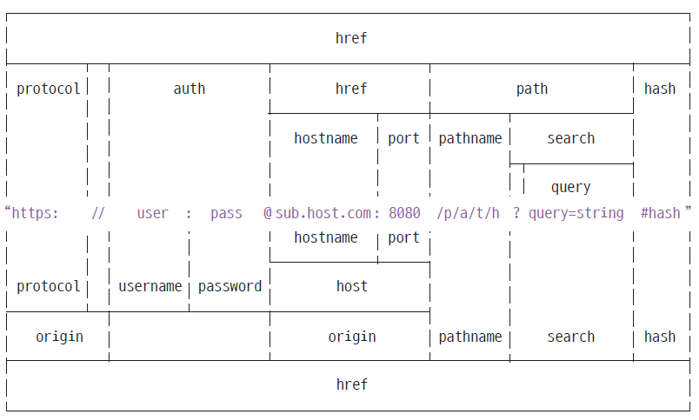
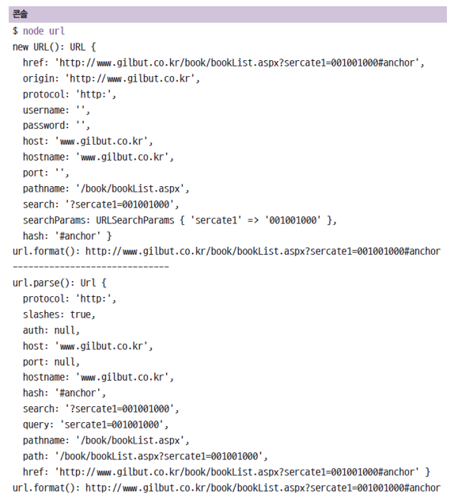
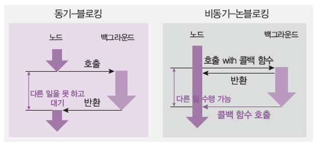
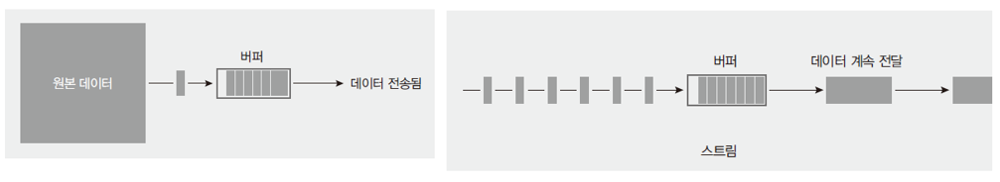

# REPL

자바스크립트는 스크립트 언어라서 즉석에서 코드를 실행할 수 있음

- REPL 이라는 콘솔 제공
- R(Read), E(Evaluate), P(Print), L(Loop)
- 윈도에서는 명령프롬프트, 맥이나 리눅스에서는 터미널에 node 입력

# 모듈

노드는 자바스크립트 코드를 모듈로 만들 수 있음

- 모듈 : 특정한 기능을 하는 함수나 변수들의 집합
- 모듈로 만들면 여러 프로그램에서 재사용 가능



- 파일끝에 module.exports로 모듈로 만들 값을 지정
- 다른 파일에서 require(파일 경로)로 그 모듈의 내용 가져올 수 있음
- require로 받아올 때 구조분해 가능

    ```java
    const { odd, even } = require('./var');
    ```

- 이거는 노드의 모듈시스템이고 자바스크립트의 모듈시스템은 따로 있다.

  module.exports → export default

  const { odd, even } = require('./var'); → import { odd, even } from './var';

    - 그렇다고 module.exports 와 export defalut 가 같고, const {} = require(); 와 import {} from '' 이 같은 건 아니므로 바꿔도 안바꿔지는 경우도 있다.

# 노드 내장 객체

## global

노드의 전역 객체

- 브라우저의 window같은 역할
- 모든 파일에서 접근 가능
- window처럼 생략도 가능(console, require도 global의 속성)

## console 객체

브라우저의 console 객체와 매우 유사

- console.time, console.timeEnd: 시간 로깅
- console.error: 에러 로깅
- console.log: 평범한 로그
- console.dir: 객체 로깅
- console.trace: 호출스택 로깅

## 타이머 메서드

set 메서드에 clear 메서드가 대응됨

- set 메서드의 리턴 값(아이디)을 clear 메서드에 넣어 취소
- setTimeout(콜백함수, 밀리초) : 주어진 밀리초(1000분의 1초) 이후에 콜백함수를 실행합니다.
- setInterval(콜백함수, 밀리초) : 주어진 밀리초마다 콜백 함수 반복 실행
- setImmediate(콜백 함수) : 콜백 함수를 즉시 실행
- clearTimeout(아이디) : setTimeout을 취소
- clearInterval(아이디) : setInteral을 취소
- clearImmediate(아이디) : setImmediate를 취소

## __filename, __dirname

- __filename : 현재 파일 경로
- __dirname : 현재 폴더(디렉토리) 경로

## module, exports

module.exports 외에도 exports로 모듈을 만들 수 있음

```java
exports.odd = '홀수입니다';
exports.even = '짝수입니다.';
```

- 동일한 이유는 module.exports와 exports가 참조관계이기 때문
- exports에 객체의 속성이 아닌 다른 값을 대입하면 참조관계가 깨짐
- exports = module.exports = {}

## this

노드에서 this를 사용할 때 주의점이 있음

- 최상위 스코프의 this는 module.exports를 가리킴
- 그 외에는 브라우저의 자바스크립트와 동일
- 함수 선언문 내부의 this는 global(전역) 객체를 가리킴

## require의 특성

- require가 제일 위에 올 필요는 없음 (import 같은 경우는 제일 위에 와야함)
- require.cache에 한번 require한 모듈에 대한 캐슁 정보가 들어있음
- require.main은 노드 실행 시 첫 모듈을 가리킴

## 순환 참조

두 개의 모듈이 서로를 require하는 상황을 조심해야 함

- Dep1이 dep2를 require 하고, dep2가 dep1을 require 함
- Dep1의 module.exports가 함수가 아니라 빈 객체가 됨 (무한 반복을 막기 위해 의도됨)
- 순환참조하는 상황이 나오지 않도록 하는 게 좋음

## process

현재 실행중인 노드 프로세스에 대한 정보를 담고 있음

- 컴퓨터마다 출력값이 PPT와 다를 수 있음



## process.env

시스템 환경 변수들이 들어있는 객체

- 비밀키(데이터베이스 비밀번호, 서드파티 앱 키 등)를 보관하는 용도로도 쓰임
- 환경 변수는 process.env로 접근 가능

    ```java
    const secretId = process.env.SECRET_ID;
    const secretCode = process.env.SECRET_CODE;
    ```

- 일부 환경 변수는 노드 실행 시 영향을 미침
- 예시) NODE_OPTIONS(노드실행옵션), UV_THREADROOL_SIZE(스레드풀 개수)
    - max-old-space-size는 노드가 사용할 수 있는 메모리를 지정하는 옵션

## process.nexttTick(콜백)

이벤트 루프가 다른 콜백 함수들보다 nextTick의 콜백 함수를 우선적으로 처리함

- 너무 남용하면 다른 콜백 함수들 실행이 늦어짐
- 비슷한 경우로 promise가 있음(nextTick처럼 우선순위가 높음)
- 아래 예제에서 setImmediate, setTimeout 보다 promise와 nextTick이 먼저 실행됨

```java
setImmediate(() => {
	console.loog('immediate');
});
process.nextTick(() => {
	console.log('nextTick');
});
setTimeout(() => {
	console.log('timeout');
}, 0);
Promise.resolve().then(() => console.log('promise'));

// nextTick
// promise
// timeout
// immediate
```

## process.exit(코드)

현재의 프로세스를 멈춤

- 코드가 없거나 0이면 정상 종료
- 이외의 코드는 비정상종료를 의미함
## os

운영체제의 정보를 담고 있음

- 모듈은 require로 가져옴(내장 모듈이라 경로 대신 이름만 적어줘도 됨)

```java
const os = require('os');

os.arch()  // process.arch와 동일
os.platform()  // process.platform 과 동일
os.type()  // 운영체제의 종류
os.uptime()  // 운영체제 부팅 이후 흐른 시간(초)을 보여줌 (process.uuptime()은 노드의 실행 시간)
os.hostname()  // 컴퓨터의 이름
os.release()  // 운영체제의 버전
os.homedir()  // 홈 디렉토리 경로
os.tmpdir()  // 임시 파일 저장 경로
os.cpus()  // 컴퓨터의 코어 정보
os.freemem()  // 사용 가능한 메모리(RAM)
os.totalmem()  // 전체 메모리 용량
```

## path

폴더와 파일의 경로를 쉽게 조작하도록 도와주는 모듈

- 운영체제별로 경로 구분자가 다름(Windows: '\', POSIX(max이랑 linux를 합침): '/')
- ./ : 현재 경로  ../ : 부모 경로  / : 절대경로(C드라이브)

```java
const path = require('path');

path.sep  // 경로의 구분자. Windows는 \, POSIZ는 / 이다.
path.delimiter  // 환경변수의 구분자. process.env.PATH를 입력하면 여러 개의 경로가 이 구분자로 구분되어 있다. Windows는 세미콜론이고, POSIX는 콜론이다.
path.dirname(경로)  // 파일이 위치한 폴더 경로를 보여준다
path.extname(경로)  // 파일의 확장자를 보여준다.
path.basename(경로, 확장자)  // 파일의 이름(확장자 포함)을 보여준다. 파일의 이름만 표시하고 싶다면 basename의 두 번째 인자로 파일의 확장자를 넣어주면 된다.
path.parse(경로)  // 파일 경로를 root, dir, base, ext, name으로 분리한다.
path.format(객체)  // path.parse()한 객체를 파일 경로로 합친다.
path.normalize(경로)  // /나 \를 실수로 여러 번 사용했거나 혼용했을 때 정상적인 경로로 변환
path.isAbsolute(경로)  // 파일의 경로가 절대경로인지 상대경로인지 true나 false로 알려줌
path.relative(기준경로, 비교경로)  // 경로를 두 개 넣으면 첫 번째 겨로에서 두 번째 경로로 가는 방법을 알려줌
path.join(경로, .. )  // 여러 인자를 넣으면 하나의 경로로 합쳐준다. 상대경로인 ..(부모 디렉토리)과 .(현 위치)도 알아서 처리해준다.
path.resolve(경로, ..)  // path.join()과 비슷하지만 차이가 있다. 
```

join과 resolve의 차이 : resolve는 /를 절대경로로 처리, join은 상대경로로 처리

- 상대 경로 : 현재 파일 기준. 같은 경로면 점 하나(.), 한단계 상위 경로면 점 두개(..)
- path.join(__dirname, '..', '/var.js'); → 절대경로 /가 있으면 /var.js에서 /를 없다고 치고 var.js로 처리함
- path.resolve(__dirname, '..', '/var.js'); → 절대경로 /가 있으면 앞의 것 (__dirname, '..')을 무시

\\ 와 \ ckdl : \는 윈도 경로 구분자, \\는 자바스크립트 문자열안에서 사용(\가 특수문자라 \\로 이스케이프 해준 것)

윈도에서 POSIX path를 쓰고 싶다면 : path.posix 객체 사용

- POSIX에서 윈도 path를 쓰고 싶다면 : path.win32 객체 사용

## url 모듈

인터넷 주소를 쉽게 조작하도록 도와주는 모듈

- url 처리에 크게 두 가지 방식이 있음(기존 노드 방식 vs WHATWG 방식)
- 아래 그림에서 가운데 주소를 기준으로 위쪽은 기존 노드 방식, 아래쪽은 WHATWG 방식



```java
const url = require('url');

const { URL } = rul
const myURL = new URL('http://www.gilbut.co.kr/book/bookList.aspx?sercate1=001001000#anchor');
console.log('new URL():', myURL);
console.log('url.format():', url.format(myURL));
console.log('-----------------');
const parsedUrl = url.parse('http://www.gilbut.co.kr/book/bookList.aspx?sercate1=001001000#anchor');
console.log('url.parse():', parseUrl);
console.log('url.format():', url.format(parseUrl));
```

- url 모듈 안에 URL 생성자가 있습니다. 이 생성자에 주소를 넣어 객체로 만들면 주소가 부분별로 정리된다. 이 방식이 WHATWG의 url 이다. WHATWG에만 있는 username, password, origin, searchParams 속성이 존재



기존 노드 방식 메서드

- url.parse(주소) : 주소를 분해한다. WHATWG 방식과 비교하면 username과 password대신 auth 속성이 있고, searchParams 대신 query가 있다.
- url.format(객체) : WHATWG 방식의 url과 기존 노드의 url 모두 사용할 수 있다. 분해되었던 url 객체를 다시 원래 상태로 조립한다.

## searchParams

WHATWG방식에서 쿼리스트링 부분 처리를 도와주는 객체

- ?page=37limit=10&catgory=nodejs&category=javascript 부분

```java
const { URL } = require('url');
const myURL = new URL('http://www.gilbut.co.kr/?page=37limit=10&catgory=nodejs&category=javascript');

myURL.searchParams.getAll(키)  // 키에 해당하는 모든 값들을 가져온다. category 키에는 두 가지 값, 즉 nodejs와 javascript의 값이 들어있다.
myURL.searchParams.get(키)  // 키에 해당하는 첫 번째 값만 가져온다.
myURL.searchParams.has(키)  // 해당 키가 있는지 없는지를 검사
myURL.searchParams.heys()  // searchParams의 모든 키를 반복기 객체로 가져온다.
myURL.searchPArams.values()  // searchParams의 모든 값을 반복기 객체로 가져온다.
myURL.searchParams.append(키, 값)  // 해당 키를 추가한다. 같은 키의 값이 있다면 유지하고 하나 더 추가한다. 
myURL.searchParams.set(키, 값)  // append와 비슷하지만 같은 키의 값이 있다면 유지하고 하나 더 추가한다.
myURL.searchParams.delete(키)  // goekd zlfmf wprjgksek.
myURL.searchParams.toString()  // 조작한 searchParams 객체를 다시 문자열로 만든다. 이 문자열을 search에 대입하믄 주소 객체에
```

## querystring

기존노드방식에서는 url querystring을 querystring모듈로 처리

- querystring.parse(쿼리) : url의 query부분을 자바스크립트 객체로 분해
- querystring.stringify(객체) : 분해된 query 객체를 문자열로 다시 조립한다.

```java
const url = require('url');
const querystring = require('querystring');

const parseUrl = url.parse('http://www.gilbut.co.kr/?page=3?limit=10&category=nodejs&category=javascript');
const query = querystring.parse(parsedUrl.query);
console.log('querystring.parse():', query);
console.log('querystring.stringify():', querystring,stringify(query));
```
## 단방향 암호화(crypto)

암호화는 가능하지만 복호화는 불가능

- 암호화 : 평문을 암호로 만듦
- 복호화 : 암호를 평문으로 해독

단방향 암호화의 대표 주자는 해시 기법

- 문자열을 고정된 길이의 다른 문자열로 바꾸는 방식
- abcdefgh문자열 → qvew

## Hash 사용하기(sha512)

createHash(알고리즘) : 사용할 해시 알고리즘을 넣어줍니다.

- md5, sha1, sha256, sha512 등이 가능하지만, md5와 sha1은 이미 취약점 발견됨
- 현재는 sha512정도로 충분하지만 나중에 sha512마저도 취약해지면 더 강화된 알고리즘으로 바꿔야함

update(문자열) : 변환할 문자열 넣어줌

igest(인코딩) : 인코딩할 알고리즘 넣어줌

- base64, hax, latin1이 주로 사용되는데, 그 중 base64가 결과 무자열이 가장 짧아 애용된다. 결과물로 변환된 문자열 반환

## pbkdf2

컴퓨터의발달로 기존 암호화 알고리즘 위협받고 있음

- sha512가 취약해지면 sha3으로 넘어가야함
- 현재는 pbkdf2나, bcrypt, scrypt 알고리즘으로 비밀번호를 암호화
- Node는 pbkdf2와 scrypt 지원

## 양방향 암호화

대칭형 암호화(암호문 복호화 가능)

- key가 사용됨
- 암호화할 때와 복호화 할 때 같은 key를 사용해야 함

## util

각종 편의 기능을 모아둔 모듈

- deprecated와 promisify 가 자주 쓰임
- util.deprecate : 함수가 deprecated 처리되었음을 알려준다.
  - 첫 번째 인자로 넣은 함수를 사용했을 때 경고 메시지 출력
  - 두번째 인자로 경고 메시지 내용을 넣으면 된다. 함수가 조만간 사라지거나 변경될 때 알려줄 수 있어 유용

```java
const util = require('util');

const dontUseMe = util.deprecate((x, y) => {
	console.log(x + y);
}, 'dontUseMe 함수는 deprecated되었으니 더 이상 사용하지 마세요!');
dontUseMe(1, 2);
```

- util.promisify : 콜백 패턴을 프로미스 패턴으로 바꿔준다.
  - 바꿀 함수를 인자로 제공하면 도니다. 이렇게 바꾸어 두면 async/await 패턴까지 사용할 수 있어 좋다.
  - util.callbackify 도 있지만 자주 사용되지는 않는다.

```java
const util = require('util');
const crypto = require('crypto');

const randomBytesPromise = util.promisify(crypto.randomBytes);
randomBytesPromise(64)
	.then((buf) => {
		console.log(buf.toString('base64'));
	})
	.catch((error) => {
		console.error(error);
	});
```

## fs

파일 시스템에 접근하는 모듈

- 파일/폴더 생성, 삭제, 읽기 쓰기 가능
- 웹 브라우저에서는 제한적이었으나 노드는 권한을 가지고 있음

## fs 프로미스

콜백 방식 대신 프로미스 방식으로 사용 가능

- require('fs').promises
- 사용하기 훨씬 더 편해서 프로미스 방식을 추천

## 동기 메서드와 비동기 메서드

동기와 비동기 : 백그라운드 작업 완료 확인 여부

블로킹과 논 블로킹 : 함수가 바로 return 되는지 여부

노드에서는 대부분 동기-블로킹 방식과 비동기-논 블로킹 방식임



## 버퍼와 스트림 이해하기

버퍼 : 일정한 크기로 모아두는 데이터

- 일정한 크기가 되면 한 번에 처리
- 버퍼링 : 버퍼에 데이터가 찰 때까지 모으는 작업

스트림 : 데이터의 흐름

- 일정한 크기로 나눠서 여러 번에 걸쳐서 처리
- 버퍼(또는 청크)의 크기를 작게 만들어서 주기적으로 데이터를 전달
- 스트리밍 : 일정한 크기의 데이터를 지속적으로 전달하는 작업



## 스트림 사이에 pipe 사용하기

pipe 로 여러 개의 스트림을 이을 수 있음

## 스레드풀 알아보기

fs, crypto, zlib 모듈의 메서드를 실행할 때는 백그라운드에서 동시에 실행됨

## UV_THREAD_SIZE

스레드풀을 직접 컨트롤할 수는 없지만 개수 조절은 가능

## 이벤트 만들고 호출하기

events 모듈로 커스텀 이벤트를 만들 수 있음

## 예외 처리

예외(Exception) : 처리하지 못한 에러

- 노드 프로세스/스레드를 멈춤
- 노드는 기본적으로 싱글 스레드라 스레드가 멈춘다는 것은 프로세스가 멈추는것
- 에러 처리는 필수

## try catch 문

기본적으로 try catch 문으로 예외를 처리

- 에러가 발생할 만한 곳을 try catch로 감쌈

## 노드 비동기 메서드의 에러

노드 비동기 메서드의 에러는 따로 처리하지 않아도 됨

- 콜백 함수에서 에러 객체 제공

## 프로미스의 에러

프로미스의 에러는 따로 처리하지 않아도 됨

- 버전이 올라가면 동작이 바뀔 수 있음

## 예측 불가능한 에러 처리하기

최후의 수단으로 사용

- 콜백 함수의 동작이 보장됮 않음
- 따라서 복구 작업용으로 쓰는것은 부적합
- 에러 내용 기록용으로만 쓰는 게 좋음

```java
process.on('uncaughtException', (err) => {
	console.error('예기치 못한 에러', err);
});

setInterval(() => {
	throw new Error('서버를 고장내주마');
}, 1000);
```

## 프로세스 종료하기

윈도

```java
netstat -ano | findstr 포트
taskkill /pid 프로세스 아이디 /f
```

맥/리눅스

```java
lsof -i tcp:포트
kill -9 프로세스아이디
```