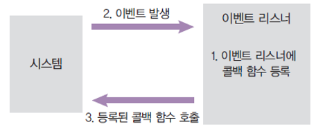
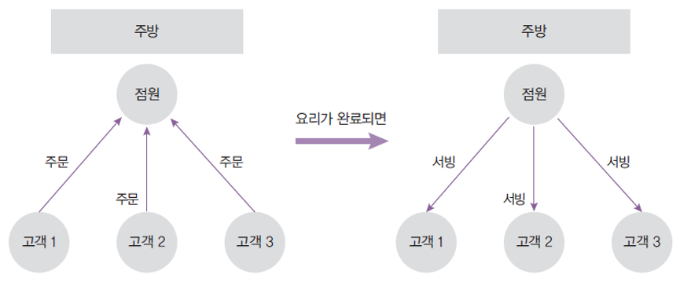
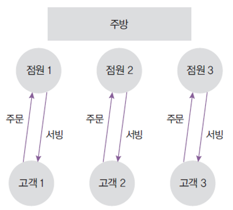

# 노드의 정의

- Node.js 는 크롬 V8 자바스크립트 엔진으로 빌드된 자바스크립트 런타임
- 노드가 나오기 전에는 자바스크립트를 실행하려면 html 파일이 없으면 실행할 수 없었지만 node가 나오고 난 뒤 html 없이도 실행 가능해졌다. (node (js파일명) ⇒ html 이나 브라우저에 대한 종속성에서 벗어날수 있었다.
- 서버의 역할도 수행할 수 있는 자바스크립트 런타임
- 노드로 자바스크립트로 작성된 서버를 실행할 수 있음
- 서버 실행을 위해 필요한 http/https/http2 모듈을 제공
- 싱글쓰레드이면서 비동기인 모델이라는 점이 장점이다.

# 노드의 특성

## 1. 이벤트 기반

(이벤트 : 어떤 동작을 할 때 다른 동작이 그에 따라 일어나는 것)

이벤트가 발생할 때 미리 지정해둔 작업을 수행하는 방식

- 이벤트의 예 : 클릭, 네트워크 요청, 타이머 등
- 이벤트 리스너 : 이벤트를 등록하는 함수
- 콜백 함수 : 이벤트가 발생했을 때 실행될 함수

## 2. 논블로킹 I/O

논 블로킹 : 오래 걸리는 함수를 백그라운드로 보내서 다음 코드가 먼저 실행되게 하고 나중에 오래 걸리는 함수를 실행

(일단 블로킹은 동기고, 논블로킹은 비동기이다. 또한 블로킹(동기)이면 코드가 순서대로 실행되고, 논블로킹(비동기)이면 코드가 순서대로 실행되지 않는다라고 생각해도 됨)

## 3. 프로세서 vs 스레드

- 프로세스 : 운영체제에서 할당하는 작업의 단위. 프로세스 간 자원 공유 X
- 스레드 : 프로세스 내에서 실행되는 작업의 단위. 부모 프로세스 자원 공유
  (크롬에서 여러 탭들을 띄울때를 예를 들면 크롬프로그램 자체는 하나의 프로세스를 띄우고 각 프로세스들은 여러개의 탭(스레드)을 띄울 수 있다.)
- 노드 프로세스는 멀티 스레드이지만 직접 다룰 수 있는 스레드는 하나이기 때문에 싱글 스레드라고 표현
  (노드는 실행하면 스레드가 4개가 생기는데 사람이 컨트롤 할 수 있는 스레드 1개를 제외한 나머지 3개는 코드를 동시에 돌릴 준비를 하고 있다. 동시에 돌리려면 특정한 조건이 만족되어야 하는데 만족되기 전까지 대기함)
- 노드는 주로 멀티 스레드 대신 멀티 프로세스 활용
- 노드는 14버전부터 멀티 스레드 사용 가능

## 4. 싱글 스레드

- 싱글 스레드라 주어진 일을 하나밖에 처리하지 못함
  → 블로킹이 발생하는 경우 나머지 작업은 모두 대기해야 함 → 비효율 발생
- 주방에 비유 (점원 : 스레드, 주문 : 요청, 서빙 : 응답)

- 대신 논 블로킹 모델을 채택하여 일부 코드(I/O)를 백그라운드 (다른 프로세스)에서 실행 가능 (Node 방식)
  → 요청을 먼저 받고 완료될 때 응답함
  → I/O 관련 코드가 아닌 경우 싱글 스레드, 블로킹 모델과 같아짐
  (주문만 받아놓고 주방에다 보낸 뒤 대기표를 주는 방식)

- 단점은 주문이 한번에 몰릴때 점원이나 주방이 힘들 수 있음. 그래서 멀티 프로세싱 방법을 사용하기도 함. (체인점을 내는 방식)

## 5. 멀티 스레드 모델과의 비교

- 싱글 스레드 모델은 에러를 처리하지 못하는 경우 멈춤
- 멀티 스레드 모델은 에러 발생 시 새로운 스레드를 생성하여 극복
  단, 새로운 스레드 생성이나 놀고 있는 스레드 처리에 비용 발생
  프로그래밍 난이도 어려움
  스레드 수만큼 자원을 많이 사용함

## 6. 멀티 스레드의 활용

- 노드 14버전에 멀티 스레드 사용할 수 있도록 함
- 멀티 프로세싱만 가능했던 아쉬움을 달래주기 위해 추가를 한 것이지 주력이 멀티 쓰레드인것은 아니다. 프로그래밍이 어려움

# 서버로서의 노드

### 노드 서버의 장단점

장점

- 멀티 스레드 방식에 비해 컴퓨터 자원을 적게 사용함
- I/O 작업이 많은 서버로 적합
- 멀티 스레드 방식보다 쉬움
- 웹 서버가 내장되어 있음
- 자바스크립트를 사용함
- JSON 형식과 호환하기 쉬움

단점

- 싱글 스레드라서 CPU 코어를 하나만 사용함
- CPU 작업이 많은 서버로는 부적합
- 하나뿐인 스레드가 멈추지 않도록 관리해야 함
- 서버 규모가 커졌을 때 서버를 관리하기 어려움
- 어중간한 성능

++ CPU 작업을 위해 AWS Lambda 나 Google Cloud Functions 같은 별도 서비스 사용

++ 페이팔, 넷플릭스, 나사, 월마트, 링크드인, 우버 등에서 메인 또는 서브 서버로 사용

## 서버 외의 노드

- 자바스크립트 런타임이기 때문에 용도가 서버에만 한정되지 않음
- 웹 - Angular, React, Vue, Meteor 등
  모바일 앱 - React Native
  데스크탑 개발 도구 - Electron(Atom, Slack, VSCode, Discord 등 제작)
- 위 프레임워크가 노드 기반으로 동작함