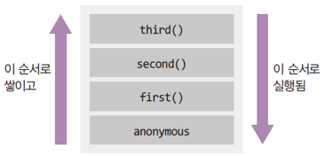
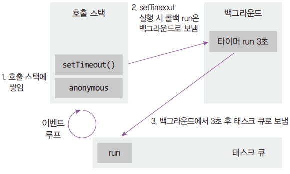

# 1. 호출스택

### 동기코드일때

```java
function first() {
	second();
	console.log('첫 번째');
}
function second() {
	third();
	console.log('두 번째');
}
function third() {
	console.log('세 번째');
}
first();
```

- 세 번째 → 두 번째 → 첫 번째



- 호출 스택
    - Anonymous은 가상의 전역 컨텍스트(항상 있다고 생각하는게 좋음. 파일이 시작될 때 생기고 끝날 때 사라짐)
    - 함수 호출 순서대로 쌓이고, 역순으로 실행됨
    - 함수 실행이 완료되면 스택에서 빠짐
    - LIFO 구조라서 스택이라고 불림
    - first() 가 끝나기 전에 second()를 호출하므로 first()가 사라지지 않고 그 위에 second()가 쌓이게 된다. 만약 first()가 끝나고 난 후 second()를 호출한다면 first()가 사라진 후 second()가 그 자리에 쌓인다.

### 비동기 코드일때

```java
function run() {
	console.log('3초 후 실행');
}
console.log('시작');
setTimeout(run, 3000);
console.log('끝');
```

- 유명한 비동기 코드 setTimeout
- 시작 → 끝 → 3초 후 실행
- 호출스택만으로는 설명이 안됨(run은 호출 안 했는데?)
- 호출 스택 + 이벤트 루프로 설명할 수 있음



### 호출 스택 연습해보기

```java
function oneMore() {
	console.log('one more');
}
function run() {
	console.log('run run');
	setTimeout(() => {
		console.log('wow');
	}, 0)
	new Promise((resolve) => {
		resolve('hi');
	})
		.then(console.log);
	oneMore();
}

setTimeout(run, 5000);
```

- run run → one more → hi → wow