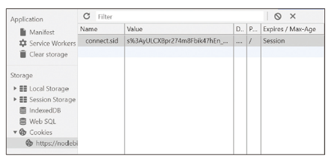
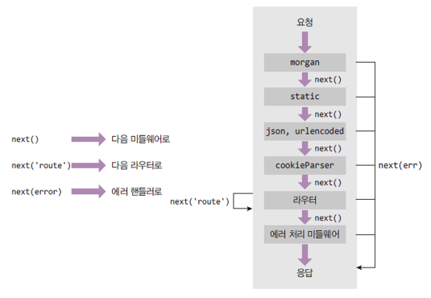

### Expres 소개

http 모듈로 웹 서버를 만들 때 코드가 보기 좋지 않고 확장성도 떨어짐

- 프레임워크로 해결

### package.json 만들기

직접 만들거나 npm init 명령어 생성

- nodemon이 소스코드 변경시 서버를 재시작해줌

```java
npm i exprss
npm i -D nodemon
```

### app.js 작성하기

서버 구동의 핵심이 되는 파일

- app.set(’port’, 포트)로 서버가 실행될 포트 지정
- app.get(’주소’, 라우터)로 GET 요청이 올때 어떤 동작을 할지 지정
- app.listen(’포트’, 콜백)으로 몇 번 포트에서 서버를 실행할 지 지정

```java
const express = require('express');
const app = express();

app.set('port', process.env.PORT || 3000);

app.get('/', (req, res) => {
	res.send('Hello, Express');
});

app.listen(app.get('port'), () => {
	console.log(app.get('port'), '빈 포트에서 대기 중');
});
```

### 서버 실행하기

- app.js : 핵심 서버 스크립트
- public : 외부에서 접근 가능한 파일들을 모아둠
- views : 템플릿 파일을 모아둠
- routes : 서버의 라우터와 로직을 모아둠
    - 추후에 models를 만들어 데이터베이스 사용

### HTML 서빙하기

res.sendFIle로 HTML 서빙 가능

### 미들웨어

익스프레스는 미들웨어로 구성됨

- 요청과 응답의 중간에 위치하여 미들웨어
- app.use(미들웨어)로 장착
- 위에서 아래로 순서대로 실행됨
- 미들웨어는 req, res, next가 매개변수인 함수
- next()로 다음 미들웨어로 넘어감

### 에러처리 미들웨어

에러가 발생하면 에러처리 미들웨어로

- err, req, res, next까지 매개변수가 4개
- 첫 번째 err에는 에러가 관한 정보가 담김
- res.status 메서드로 HTTML 상태코드를 지정가능 (기본값 200)
- 에러 처리 미들웨어를 안 연결해도 익스프레스가 에러를 알아서 처리해주긴 함
- 특별한 경우가 아니면 가장 아래에 위치하도록 함

### 자주 쓰는 미들웨어

morgan, cookie-parser, express-session 설치

- app.use로 장착
- 내부에서 알아서 next를 호출해서 다음 미들웨어로 넘어감

```java
npm i morgan cookie-parser express-session dotenv
```

### dotenv

.env 파일을 읽어서 process.env로 만듦

- dot(점) + env
- process.env.COOKIE_SECRET에 cookiesecret 값이 할당됨(키=값 형식)
- 비밀 키들을 소스코드에 그대로 적어두면 소스 코드가 유출되었을 때 비밀 키도 같이 유출됨
- .env 파일에 비밀 키들을 모아두고 .env 파일만 잘 관리하면 됨

### morgan

서버로 들어온 요청과 응답을 기록해주는 미들웨어

- 로그의 자세한 정도 선택 가능 (dev, tiny, short, common, combined)
- 개발환경에서는 dev, 배포 환경에서는 combined 를 애용

### static

정적인 파일들을 제공하는 미들웨어

- 인수로 정적 파일의 경로를 제공
- 파일이 있을 때 fs.readFile로 직접 읽을 필요 없음
- 요청하는 파일이 없으면 알아서 next 를 호출해 다음 미들웨어로 넘어감
- 파일을 발견했다면 다음 미들웨어는 실행되지 않음

```java
app.use('요청경로', express.static('실제 경로'));
app.use('/', express.static(path.join(__dirname, 'public')));
```

### body-parser

요청의 본문을 해석해주는 미들웨어

- 폼 데이터나 AJAX 요청의 데이터 처리
- json 미들웨어는 요청 본문이 json인 경우 해석, urlencoded 미들웨어는 폼 요청 해석

```java
app.use(express.json());
app.use(express.urlencoded({ extended: false }));
```

### cookie-parser

요청 헤더의 쿠키를 해석해주는 미들웨어

- parseCookies 함수와 기능 비슷
- req.cookies 안에 쿠키들이 들어있음

```java
app.use(cookieParser(비밀키));
```

- 비밀 키로 쿠키 뒤에 서명을 붙여 내 서버가 만든 쿠키임을 검증할 수 있음

실제 쿠키 옵션들을 넣을 수 있음

- expires, domain, httpOnly, maxAge, path, secure, sameSite 등
- 지울 때는 clearCookie로 (expires와 maxAge를 제외한 옵션들이 일치해야 함)

```java
res.cookie('name', 'zerocho', {
	expires: new Date(Date.now() + 900000),
	httpOnly: true,
	secure: true,
});
res.clearCookie('name', 'zerocho', { httpOnly: true, secure: true });
```

### express-session

세션 관리용 미들웨어

```java
app.use(session({
	resave: false,
	saveUninitialized: false,
	secret: process.env.COOKIE_SECRET,
	cookie: {
		httpOnly: true,
		secure: false,
	},
	name: 'session-cookie',
}));

req.session.name = 'zerocho';  // 세션 등록
req.sessionID;  // 세션 아이디 확인
req.session.destroy();  // 세션 모두 제거
```



### 미들웨어의 특성

req, res, next 를 매개변수로 가지는 함수

```java
app.use(req, res, next) => {
	console.log('모든 요청에 다 실행됩니다.');
	next();
});
```

익스프레스 미들웨어들도 다음과 같이 축약 가능

- 순서가 중요
- static 미들웨어에서 파일을 찾으면 next를 호출 안하므로 json, urlencoded, cookieParser는 실행되지 않음

```java
app.use(
	morgan('dev'),
	express.static('/', path.join(__dirname, 'public')),
	express.json(),
	express.urlencoded({ extended: false }),
	cookieParser(process.evn.COOKIE_SECRET),
);
```

### next

next를 호출해야 다음 코드로 넘어감

- next를 주석처리하면 응답이 전송되지 않음
- 다음 미들웨어(라우터 미들웨어) 로 넘어가지 않기 때문
- next에 인수로 값을 넣으면 에러 핸들러로 넘어감(’route’인 경우 다음 라우터로)



### 미들웨어간 데이터 전달하기

req나 res 객체 안에 값을 넣어 데이터 전달 가능

- app.set 과의 차이점 : app.set은 서버 내내 유지, req, res는 요청 하나 동안만 유지
- req.body나 req.cookies같은 미들웨어의 데이터와 겹치지 않게 조심

```java
app.use((req, res, next) => {
	req.data = '데이터 넣기';
	next();
}, (req, res, next) => {
	console.log(req.data);  // 데이터 받기
	next();
});
```

### 미들웨어 확장하기

미들웨어 안에 미들웨어를 넣는 방법

- 아래 두 코드는 동일한 역할

```java
app.use(morgan('dev'));
// 또는
app.use((req, res, next) => {
	morgan('dev')(req, res, next);
});
```

- 아래처럼 다양하게 활용 가능

```java
app.use((req, res, next) => {
	if (process.env.NODE_ENV === 'production') {
		morgan('combined')(req, res, next);
	} else {
		morgan('dev')(req, res, next);
	}
});
```

### 멀티파트 데이터 형식

form 태그의 enctype이 multipart/form-data 인 경우

- body-parser로는 요청 본문을 해석할 수 없음
- multer 패키지 필요

```java
npm i multer
```

```java
<form action="/upload" method="post" enctype="multipart/form-data">
	<input type="file" name="image" />
	<input type="text" name="title" />
	<button type="submit">업로드</button>
</form>
```

### multer 설정하기

multer 함수를 호출

- storage는 저장할 공간에 대한 정보
- distStorage는 하드디스크에 업로드 파일을 저장한다는 것
- destination은 저장할 경로
- filename은 저장할 파일명(파일명 + 날짜 + 확장자 형식)
- Limits는 파일 개수나 파일 사이즈를 제한할 수 있음

```java
const multer = require('multer');

const upload = multer({
	storage: multer.diskStorage{(
		destination(req, file, done) {
			done(null, 'uploads/');
		},
		filename(req, file, done) {
			const ext = path.extname(file.originalname);
			done(null, path.basename(file.oriainalname, ext) + Date.now() + ext);
		},
	}),
	Limits: { fileSize: 5 + 1024 + 1024 },
});
```

- 실제 서버 운영시에는 서버 디스크 대신에 S3같은 스토리지 서비스에 저장하는게 좋음

### multer 미들웨어들

single과 none, array, fields 미들웨어 존재

- single은 하나의 파일을 업로드할때, none은 파일은 업로드 하지 않을 때
- req.file 안에 업로드 정보 저장

```java
app.post('/upload', upload.single('image'), (req, res) => {
	console.log(req.file, req.body);
});

app.post('/upload', upload.none(), (req, res) => {
	console.log(req.body);
	res.send('ok');
});
```

### express.Router

app.js가 길어지는 것을 막을 수 있음

- userRouter의 get은 /user와 /가 합쳐져서 GET /user/가 됨

### 라우트 매개변수

:id를 넣으면 req.params.id로 받을 수 있음

- 동적으로 변하는 부분을 라우트 매개변수로 만듦

```java
router.get('/user/:id', function(req, res) {
	console.log(req.params, req.query);
});
```

- 일반 라우터보다 뒤에 위치해야 함

```java
router.get('/user/:id', function(req, res) {
	console.log('얘만 실행된다.);
});
router.get('/user/like', function(req, res) {
	console.log('전혀 실행되지 않습니다.');
});
```

### 404 미들웨어

요청과 일치하는 라우터가 없는 경우를 대비해 404 라우터를 만들기

```java
app.use((req, res, next) => {
	res.status(404),send('Not Found');
});
```

- 이게 없으면 단순히 Cannot GET 주소라는 문자열이 표시됨

### 라우터 그룹화하기

주소는 같지만 메서드가 다른 코드가 있을 때

```java
router.get('/abc', (req, res) => {
	res.send('GET /abc');
});
router.post('/abc', (req, res) => {
	res.send('POST /abc');
});
```

router.route 로 묶음

```java
router.route('/abc')
	.get((req, res) => {
		res.send('GET /abc');
	})
	.post((req, res) => {
		res.send('POST /abc');
	});
```

### req

- req.app : req 객체를 통해 app 객체에 접근할 수 있다.
  req.app.get(’port’)와 같은 식으로 사용할 수 있다.
- req.body : body-parser 미들웨어가 만드는 요청의 본문을 해석한 객체
- req.cookies : cookie-parser 미들웨어가 만드는 요청의 쿠키를 해석한 객체
- req.ip : 요청의 ip 주소가 담겨있다.
- req.params : 라우트 매개변수에 대한 정보가 담긴 객체
- req.query : 쿼리 스트링에 대한 정보가 담긴 객체
- req.signedCookies : 서명된 쿠키들은 req.cookies 대신 여기에 담겨 있다.
- req.get(헤더 이름) : 헤더의 값을 가져오고 싶을 때 사용하는 메서드

### res

- res.app : req.app 처럼 res 객체를 통해 app 객체에 접근할 수 있다.
- res.cookie(키, 값, 옵션) : 쿠키를 설정하는 메서드
- res.clearCookie(키, 값, 옵션) : 쿠키를 제거하는 메서드
- res.end() : 데이터없이 응답을 보낸다.
- res.json(JSON) : JSON형식의 응답을 보낸다.
- res.redirect(주소) : 리다이렉트할 주소와 함께 응답을 보낸다.
- res.render(뷰, 데이터) : 다음 절에서 다룰 템플릿 엔진을 렌더링해서 응답할 때 사용하는 메서드
- res.send(데이터) : 데이터와 함께 응답을 보낸다. 데이터는 문자열일수도 있고 html 일수도 있으며 버퍼일수도 있고 객체나 배열일 수 도 있다.
- res.sendFile(경로) : 경로에 위치한 파일 응답
- res.sendHeader(헤더, 값) : 응답의 헤더를 설정
- res.status(코드) : 응답 시의 http 상태 코드를 지정

res.end(), res.json(), res.redirect(), res.render(), res.send(), res.sendFIle() 은 전체 요청에 대해 딱 한번만 사용가능. 두번이상사용하면 에러. return 역할이 아니다.

메서드 체이닝 지원

```java
res
	.status(201)
	.cookie('test', 'test')
	.redirect('/admin');
```